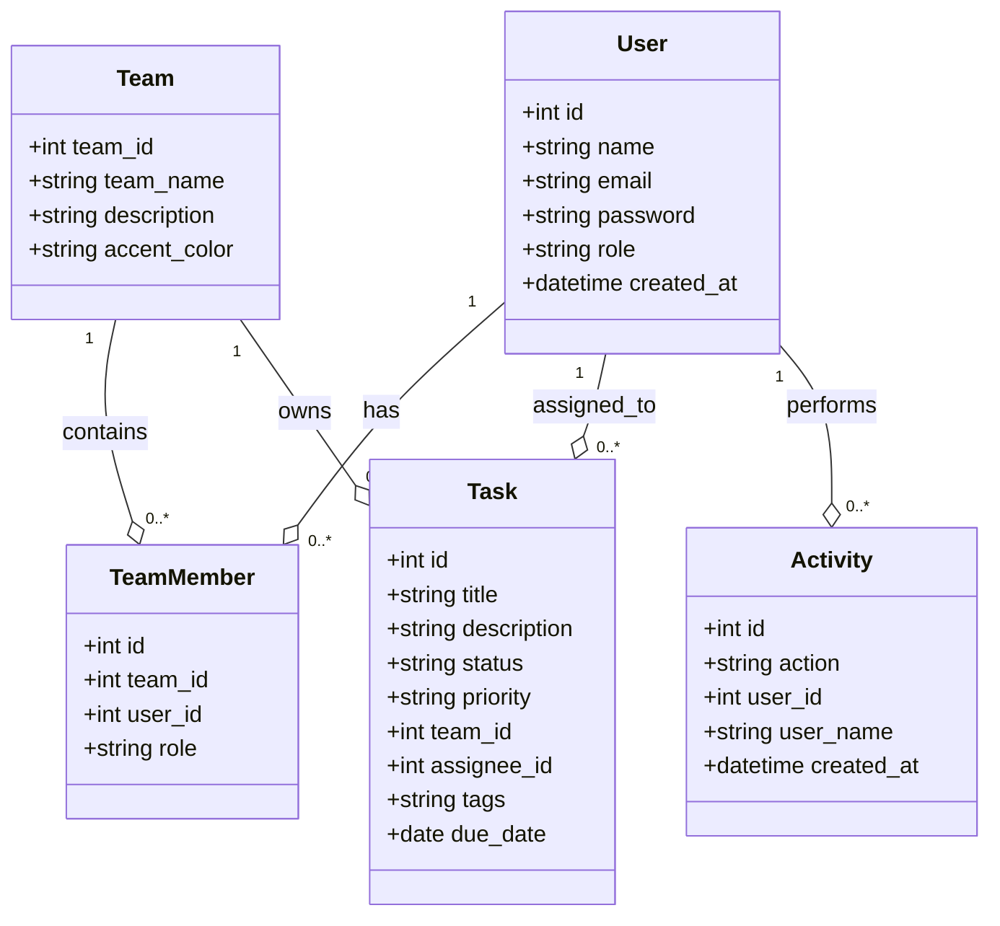
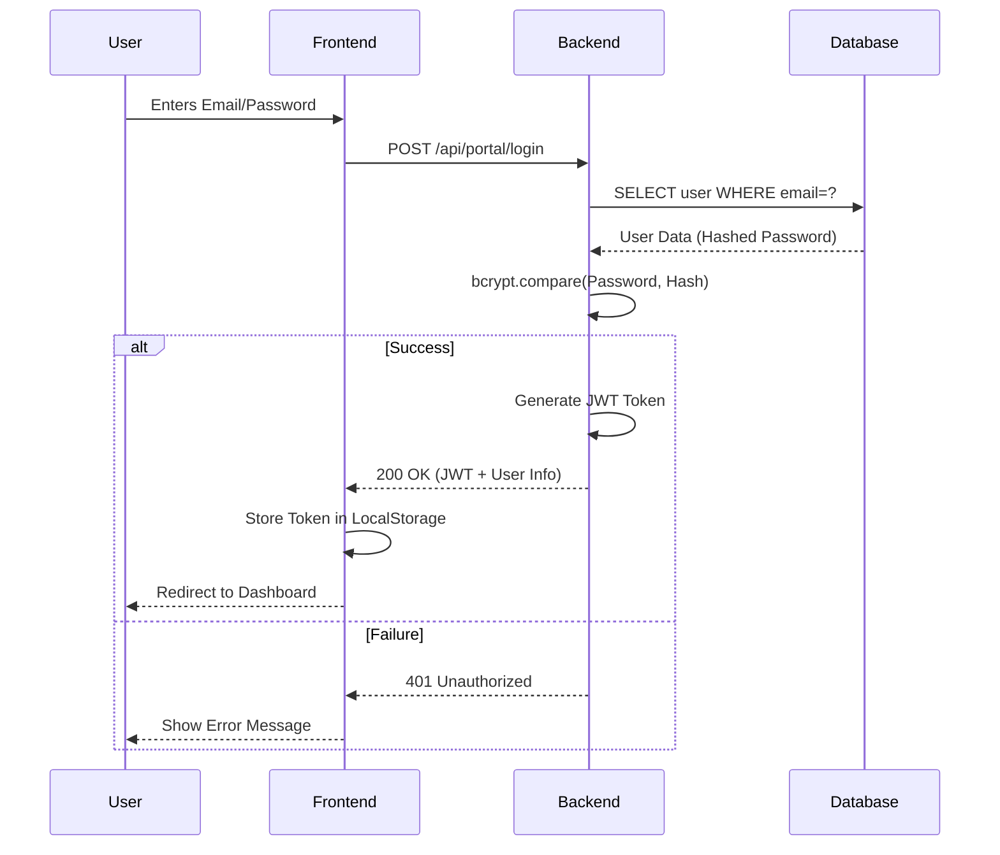
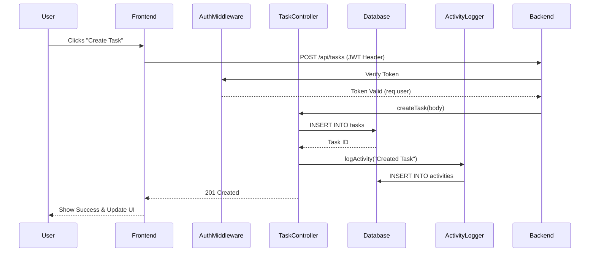

# Project Design Diagrams

This document contains the design diagrams for TeamFlow. You can view these diagrams using a Mermaid-enabled Markdown viewer (like VS Code with Mermaid extension or GitHub).

## 1. UML Class Diagram
Shows the relationships between the core data entities.



## 2. Use-Case Diagram
Shows the interactions between different users and the system.

```mermaid
useCaseDiagram
    actor "Registered User" as U
    actor "Admin User" as A

    package TeamFlow {
        usecase "Login / Register" as UC1
        usecase "Create Task" as UC2
        usecase "Manage Kanban Board" as UC3
        usecase "Create Team" as UC4
        usecase "Add Team Members" as UC5
        usecase "View Analytics" as UC6
        usecase "Delete Any Task" as UC7
    }

    U --> UC1
    U --> UC2
    U --> UC3
    U --> UC4
    U --> UC5
    U --> UC6

    A --> UC7
    A --|> U
```

## 3. Sequence Diagram: Authentication Flow
Shows the steps for a user to log in and receive a JWT.



## 4. Sequence Diagram: Task Creation
Shows how a task is created and logged.



